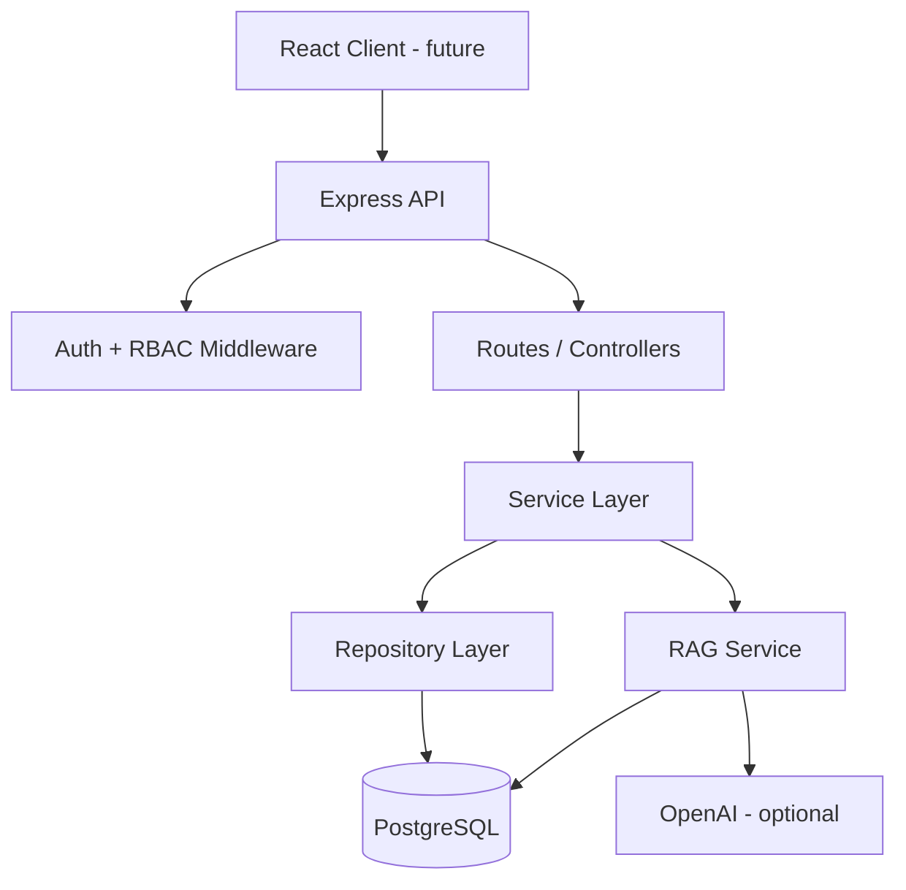

# Flight Booking API

Node.js/Express backend for a flight booking platform with customer and airline admin roles, transactional seat booking, and an admin-only RAG chatbot over customer feedback.

## Architecture



### Layered design

| Layer | Responsibility |
|-------|----------------|
| Routes | HTTP mapping, middleware chains |
| Controllers | Request/response translation |
| Services | Business rules, transactions |
| Repositories | Prisma data access |

## Features

### Customer
- Register / login (JWT)
- Search flights (filter, sort, paginate)
- View flight details + seat availability
- Book and cancel seats (transactional)

### Airline Admin
- Create flights
- Update seat capacity
- View per-flight bookings
- RAG chatbot over customer feedback (admin-only)

### RAG Chatbot
- Ingests `data/customer_feedback.json` into `feedback_chunks`
- Metadata filters: flight number, airline, category, date range, rating
- Semantic retrieval via local embeddings + cosine similarity
- Grounded answers with source references
- Returns "insufficient data" when retrieval is empty/weak
- Optional `OPENAI_API_KEY` for LLM synthesis (temperature 0, context-only)

### Chunking strategy comparison
| Strategy | Size | Behavior |
|----------|------|----------|
| `small` | 120 chars | More chunks, narrower context, better for pinpoint quotes |
| `large` | 400 chars | Fewer chunks, richer context, better for thematic summaries |

Run `npm run ingest:feedback:small` vs `npm run ingest:feedback` and compare chatbot answers.

## Database schema

```
User 1──* Booking *──1 Flight
User 1──* Flight (createdBy)
FeedbackChunk (vector store table)
```

### Indexes (with justification)
- `idx_flights_route_departure` — speeds route + date window searches
- `idx_flights_flight_number` — admin/customer lookup by flight code
- `idx_bookings_user_status` — "my upcoming bookings" queries
- `idx_bookings_flight_status` — admin per-flight booking lists
- `idx_feedback_flight_date` — chatbot metadata filtering

### Transactions
- **Book seat**: check seat + decrement `availableSeats` + insert booking (atomic)
- **Cancel booking**: mark cancelled + increment `availableSeats` (atomic)

## Auth decisions

- **JWT** signed with `JWT_SECRET`, default expiry `1h`
- **Passwords** hashed with bcrypt (12 rounds)
- **RBAC** enforced server-side via `requireRole(AIRLINE_ADMIN)`
- **JWT storage (frontend guidance)**:
  - `localStorage`: simpler SPA integration, vulnerable to XSS
  - `httpOnly` cookie: better XSS resistance, needs CSRF protection
  - **Recommendation**: httpOnly cookie for production; document tradeoff in frontend README

## API

Base URL: `http://localhost:3000/api/v1`

| Method | Endpoint | Auth | Role |
|--------|----------|------|------|
| POST | `/auth/register` | No | - |
| POST | `/auth/login` | No | - |
| GET | `/auth/me` | Yes | Any |
| GET | `/flights/search` | Yes | Any |
| GET | `/flights/:id` | Yes | Any |
| POST | `/flights` | Yes | Admin |
| PATCH | `/flights/:id/seats` | Yes | Admin |
| GET | `/flights/:id/bookings` | Yes | Admin |
| POST | `/bookings` | Yes | Customer |
| GET | `/bookings/me` | Yes | Customer |
| PATCH | `/bookings/:id/cancel` | Yes | Customer |
| POST | `/chatbot/query` | Yes | Admin |

Swagger UI: `http://localhost:3000/api/docs`

### Error response shape
```json
{
  "success": false,
  "error": {
    "code": "VALIDATION_ERROR",
    "message": "Validation failed",
    "details": {}
  }
}
```

## Local setup

```bash
cp .env.example .env
docker compose up -d db
npm install
npm run db:generate
npm run db:migrate
npm run db:seed
npm run dev
```

### Seed accounts
- Admin: `admin@airline.com` / `AdminPass123!`
- Customer: `customer@example.com` / `CustomerPass123!`

## Docker

```bash
docker compose up --build
```

## Example requests

```bash
# Login as admin
curl -s -X POST http://localhost:3000/api/v1/auth/login \
  -H 'Content-Type: application/json' \
  -d '{"email":"admin@airline.com","password":"AdminPass123!"}'

# Chatbot query
curl -s -X POST http://localhost:3000/api/v1/chatbot/query \
  -H "Authorization: Bearer <TOKEN>" \
  -H 'Content-Type: application/json' \
  -d '{"question":"What feedback did we receive for Flight AI-203 during June 2026?"}'
```

## Project structure

```
src/
  config/          # env validation
  controllers/     # HTTP handlers
  docs/            # OpenAPI spec
  middleware/      # auth, logging, validation, errors
  repositories/    # Prisma queries
  routes/          # route definitions
  services/        # business logic + RAG
  utils/           # logger, jwt, pagination
data/
  customer_feedback.json
prisma/
  schema.prisma
  seed.ts
scripts/
  ingest-feedback.ts
```

## Next steps (frontend + DevOps)
- React + TypeScript frontend (feature folders, TanStack Query, protected routes)
- Terraform for cloud compute + least-privilege IAM
- GitHub Actions CI/CD with secrets from GH Actions / cloud secrets manager
